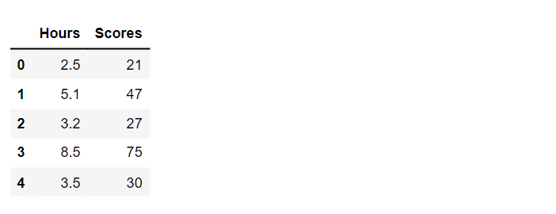
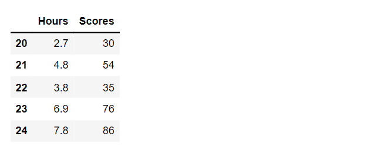
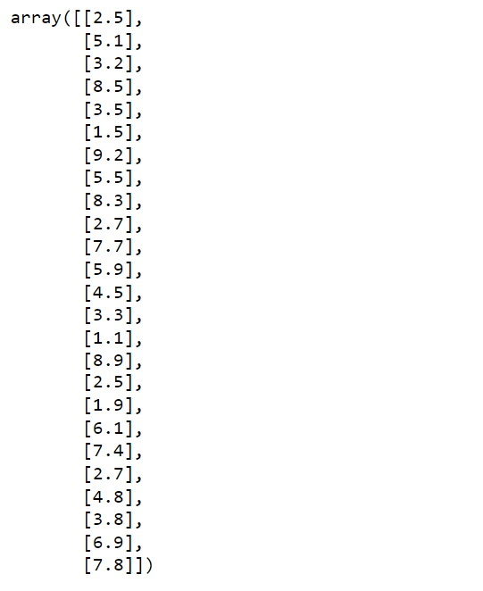
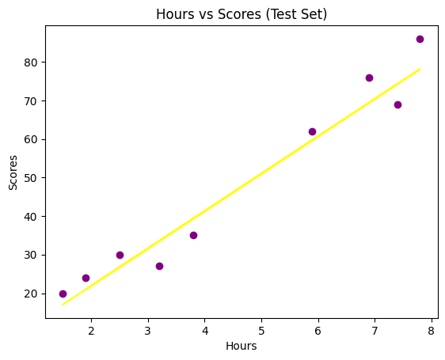

# Implementation-of-Simple-Linear-Regression-Model-for-Predicting-the-Marks-Scored

## AIM:
To write a program to predict the marks scored by a student using the simple linear regression model.

## Equipments Required:
1. Hardware – PCs
2. Anaconda – Python 3.7 Installation / Jupyter notebook

## Algorithm
1. Import Libraries: Import essential libraries for data manipulation, numerical operations, plotting, and regression analysis.
2. Load and Explore Data: Load a CSV dataset using pandas, then display initial and final rows to quickly explore the data's structure.
3. Prepare and Split Data: Divide the data into predictors (x) and target (y). Use train_test_split to create training and testing subsets for model building and evaluation.
4. Train Linear Regression Model: Initialize and train a Linear Regression model using the training data.
5. Visualize and Evaluate: Create scatter plots to visualize data and regression lines for training and testing. Calculate Mean Squared Error (MSE), Mean Absolute Error (MAE), and Root Mean Squared Error (RMSE) to quantify model performance.
## Program:
```
Program to implement the simple linear regression model for predicting the marks scored.
Developed by: Niteesh M
RegisterNumber: 212222230098
```
``` python
import pandas as pd
import numpy as np
import matplotlib.pyplot as plt
from sklearn.metrics import mean_absolute_error, mean_squared_error

df = pd.read_csv("student_scores.csv") 
df.head()
df.tail()

x=df.iloc[:,:-1].values
x

y=df.iloc[:,1].values
y

from sklearn.model_selection import train_test_split
x_train,x_test,y_train,y_test=train_test_split(x,y,test_size=1/3,random_state=0)

from sklearn.linear_model import LinearRegression
regressor=LinearRegression()
regressor.fit(x_train,y_train)
y_pred=regressor.predict(x_test)

y_pred

y_test

plt.scatter(x_train,y_train,color="blue",s=60)
plt.plot(x_train,regressor.predict(x_train),color="yellow",linewidth=4)
plt.title("hours vs scores(training set)",fontsize=24)
plt.xlabel("Hours",fontsize=18)
plt.ylabel("scores",fontsize=18)
plt.show()

plt.scatter(x_test,y_test,color="purple",s=60)
plt.plot(x_test,regressor.predict(x_test),color="yellow",linewidth=4)
plt.title("hours vs scores(training set)",fontsize=24)
plt.xlabel("Hours",fontsize=18)
plt.ylabel("scores",fontsize=18)
plt.show()


mse=mean_squared_error(_test,y_pred)
print('MSE = ',mse)

mae=mean_absolute_error(y_test,y_pred)
print('MAE = ',mae)

rmse=np.sqrt(mse)
print("RMSE = ",rmse)
```

## Output:
### Head:

### Tail:

### Array value of X:

### Array value of Y:

### Values of Y prediction:

### Array values of Y test:

### Training Set Graph:

### Test Set Graph:

### Values of MSE, MAE and RMSE:


## Result:
Thus the program to implement the simple linear regression model for predicting the marks scored is written and verified using python programming.
